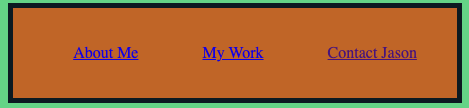
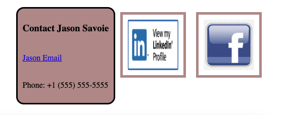

# This Website is to display My portfolio of work. 

What is displayed is header information with my name and the ability to click on a navigation bar to take you to various parts of the website; a small part about who I am and working experience, including a change into Softare Developement; My work which shows the projects I've worked on while a Software Developer; and finally a way to contact me via email or social media.

## A bit about how to use this page

Besides browsing through the page, you can select at the top right navication of the page which will help to navigate through it quickly. 
)

One such navigation is to go to the Contacts at the bottom of the page, where you can contact me (the writer of this page).

)

As you traverse the page, you can select the various Project pictures and it should take you to those pages so you can view them for yourselves. One example is the Horisean Project which was about styling and refactoring a sites CSS to improve performance and readability of the code.

## Some Technologies Relyed upon to complete this task
| Technology Used         | Resource URL           | 
| ------------- |:-------------:| 
| HTML    | [https://developer.mozilla.org/en-US/docs/Web/HTML](https://developer.mozilla.org/en-US/docs/Web/HTML) | 
| CSS W3School     | [https://www.w3schools.com/css](https://www.w3schools.com/css)      |   
| GitHub | [https://github.com/](https://github.com/)     |    

## Where to find this code and website
| Links to Code        | Resource URL           | 
| ------------- |:-------------:| 
| Portfolio Website    | [https://flimits.github.io/my-portfolio/](https://flimits.github.io/my-portfolio/) | 
| GitHub Repo | [https://github.com/flimits/my-portfolio](https://github.com/flimits/my-portfolio)     |    

## Challenges and Other Issues

The project started out going really well, and very hopeful to finish. However, as I was writing code, strange things kept happening like flex would not resize, or margins didn't come out right, boxes, borders and general spacing of the elements were continually breaking. However, in the eand some things that helped were the following:

### Don't worry about marging sizes and whatnot in CSS
- Yeah, I started putting this stuff in place as I went down thepage which messed up subsequent containers.
- Also could should have paid more attention to thigns like pseudo code for hover, active and visited
- Instead of working on the project, working on understanding each element would have helped.
- There is a lot of this page that does not work. Simply ran out of time and will need to get more turoring on parts of it.

## Shout outs

* A lot of people in the study groups helped each other (and me, especially) to get past some of the hurdles I was having. Tutoring and Mentoring was good and gave reassurance to finishing.
* tools like ChatGPT and www.w3shcool.com helped tremendously.